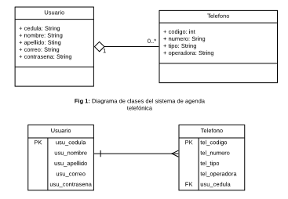
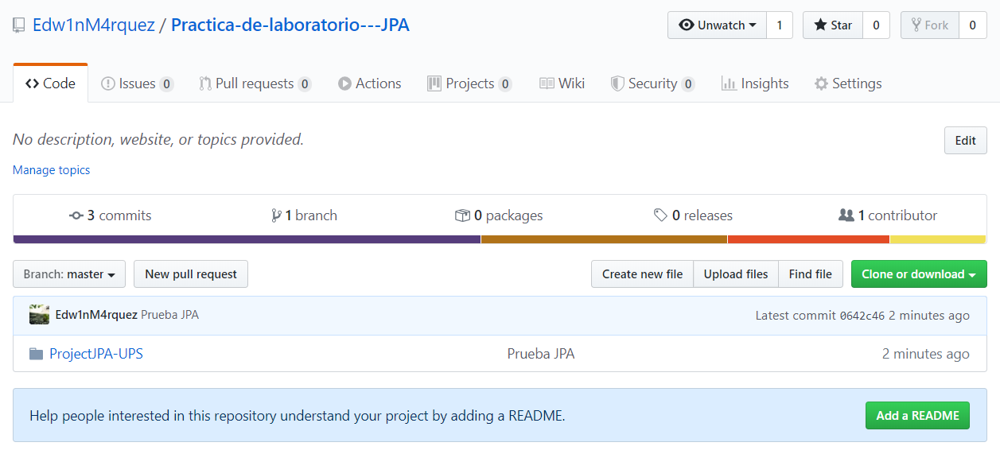
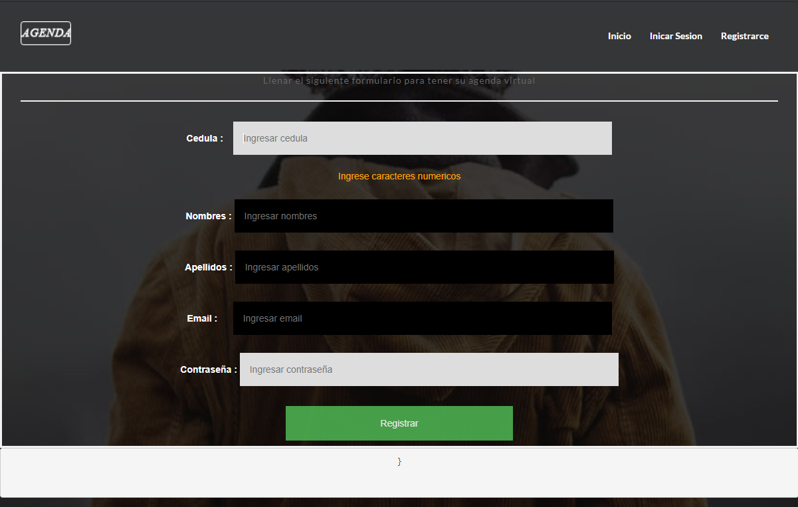
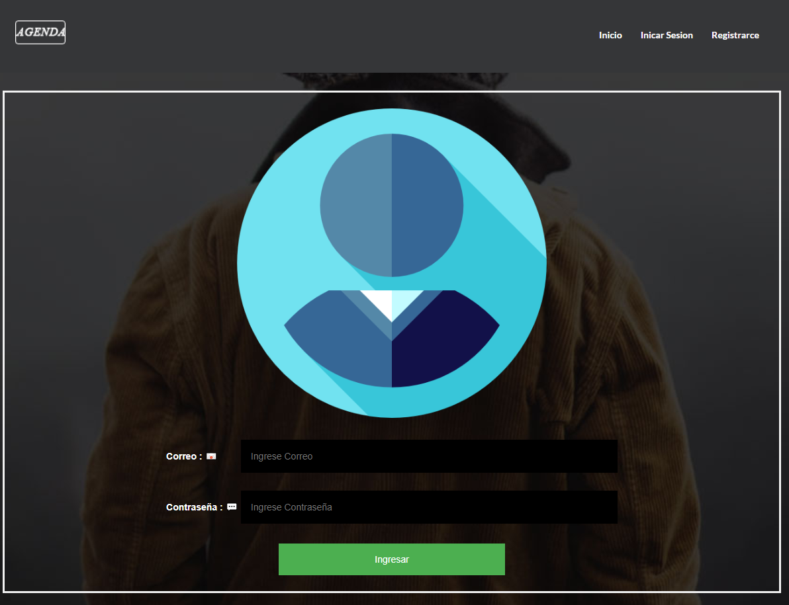
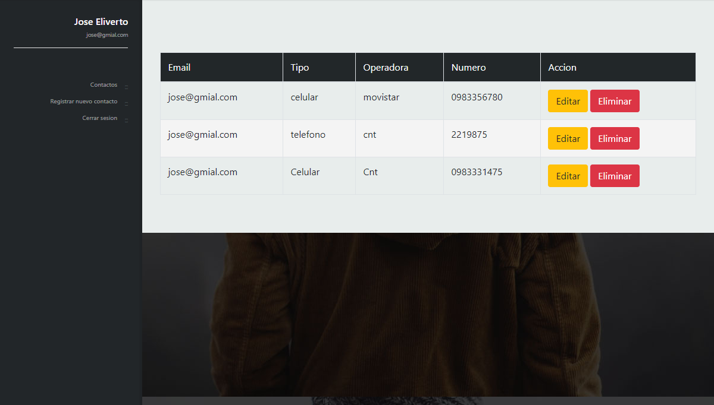
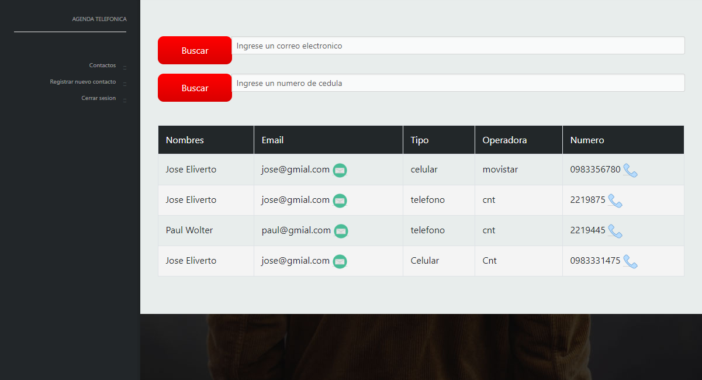
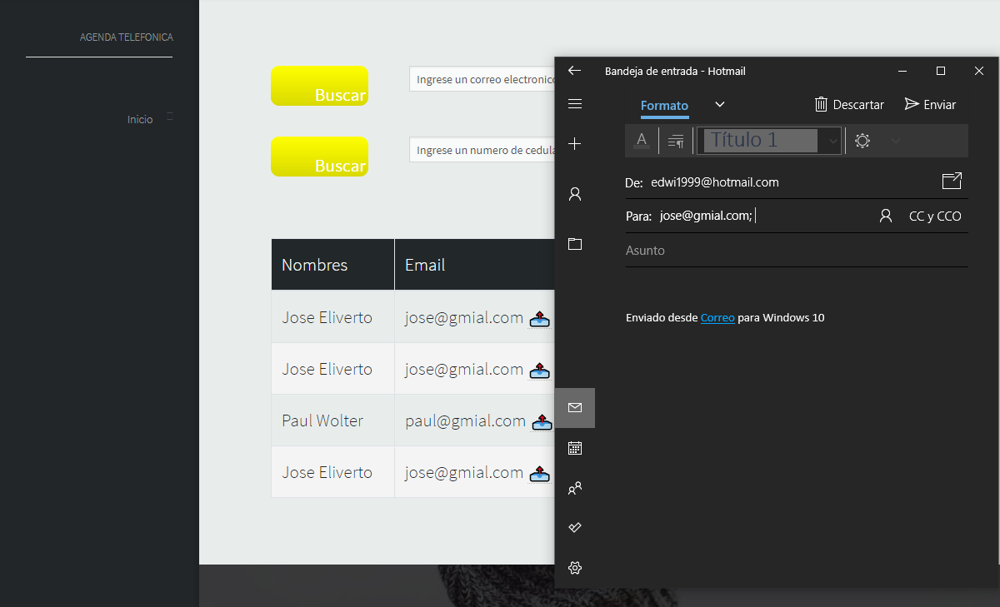
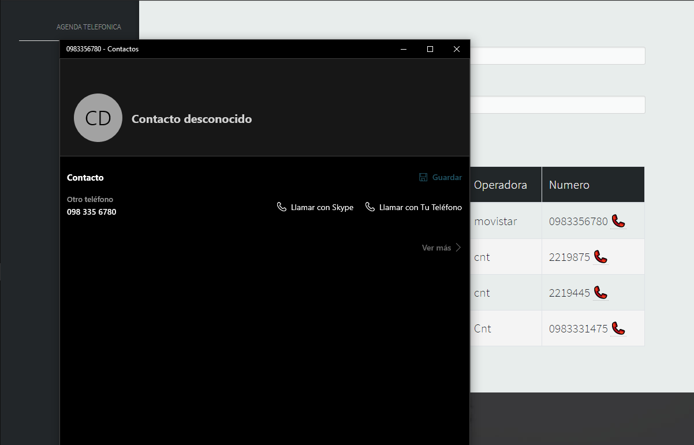
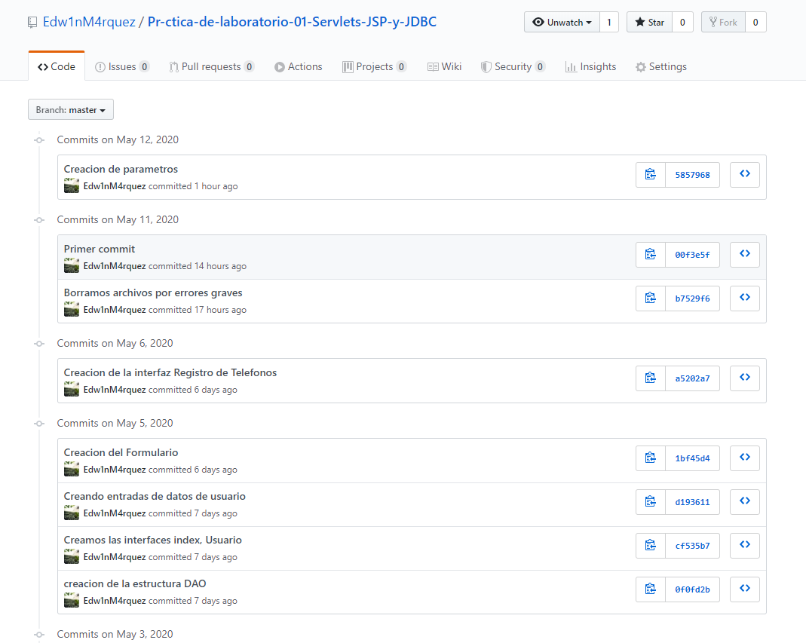

*Desarrollo de una aplicacion JEE basado en Servlets, JSP y JPA para el intercambio de datos
 en un modelo de tres capas aplicando los patrones diseno de software MVC y DAO*

<h2>Base de datos</h2>

1.	Crear un repositorio en GitHub con el nombre “Práctica de laboratorio 01: Servlets, JSP y JPA”

2.	Desarrollar una aplicación con tecnología JEE para gestionar una agenda telefónica en la web.
1.1.	Se pide desarrollar una aplicación JEE que permita implementar una agenda telefónica en donde se tendrán usuarios con datos como cedula, nombres, apellidos, correo y contraseña. Y cada uno de estos usuarios podrá tener asignado uno o más teléfonos de contacto de diferente tipo y operador, por ejemplo: 
 
• El usuario “Juanito” tiene los teléfonos 0998121212 de tipo celular y operadora Movistar; así como también tiene asignado el teléfono 0728222111 de tipo convencional y operador CNT. 
 
De igual manera cada usuario podrá tener asignado a su agenda telefónica cero o muchos usuarios del sistema. Para lo cual, se propone el siguiente diagrama de clases: 
1.2.	Los requerimientos funcionales del sistema son:
Los usuarios pueden registrarse en la aplicación a través de un formulario de creación de cuentas. 

Un usuario puede iniciar sesión usando su correo y contraseña.

- Una vez iniciado sesión el usuario podrá:
Registrar, modificar, eliminar, buscar y listar sus teléfonos

Listar los números de teléfono de un usuario usando su número de cédula o correo electrónico

Podrá llamar o enviar un correo electrónico desde el sistema usando aplicaciones externas. 

3.	Realizar varios commits en la herramienta GitHub que demuestren el desarrollo de la aplicación.

<h1>Conclusiones</h1>
<h4>- La principal ventaja de utilizar JSP frente algunos lenguajes tradicionales, nos ayuda a desarrollar páginas web dinámicas basadas en HTML, XML, otro tipo de documentos.</h4>
<h4>- Los servlets nos ayuda ampliar capacidades por ejemplo de un servidor, ya que son pequeños programas que se ejecutan en el contexto de un navegador web.</h4>
<h4>- JPA Java Persistence API, más conocida por sus siglas JPA, es la API de persistencia desarrollada para la plataforma Java EE. </h4>
<h4>- Una de las ventajas de utilizar el Patrón DAO es que cualquier objeto de negocio (aquel que contiene detalles específicos de operación o aplicación) no requiere conocimiento directo del destino final de la información que manipula.</h4>